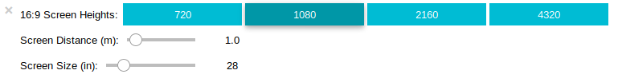

# Monitor-modelling

Modelling of monitor screen sizes and the distance you sit from them. A Jupyter notebook python program that uses adjustment of widgets to model different scenarios.



Using toggle buttons selection is made of one of four different resolution 16:9 High Definition monitors. Using slider controls adjustments are made to the screen size and the distance from the monitor. 

For example the following information is displayed when sitting 1 meter from a 28 inch Ultra High Definition monitor: 

```
    Horizontal Pixels: 1920
    Vertical Pixels: 1080
    Screen Size: 28in.
    Screen Size: 71.1cm
    Width of Screen: 62.0cm
    Height of Screen: 34.9cm
    Screen distance: 100cm
    Viewing Angle: 34.4°
    Pixels per degree: 55.7
    Distance to screen edge: 104.7cm
    Difference: Centre to Edge: 4.7cm
    Difference: Centre to Edge: 4.7%
```

There are many on-line guides that recommend optimum viewing angles and screen distances. This program may be assistive to use in conjunction with the recommendations. 

For example: 
https://www.rtings.com/tv/reviews/by-size/size-to-distance-relationship


## Note to Python programmers.

The Jupyter notebook code cell was developed on a Ubuntu-Mate platform as of Sep 2019:

With Ubuntu 18.04.3 LTS the apt repository loads Jupyter with the version of the notebook server: `5.2.2`, where `print(ipywidgets.version_info)` returns: `(6, 0, 0)`

With Jupyter installation via PYPI in a virtual environment then pip loads Jupyter with the version of the notebook server: `6.0.1`, where `print(ipywidgets.version_info)` returns: `(7, 5, 1, 'final', 0)` 

Be aware that there are some differences in widget behaviour between versions. Please refer to the changelog: https://ipywidgets.readthedocs.io/en/latest/changelog.html

## Updates.

2019-10-03. Corrected calulations to use math.atan() function.
